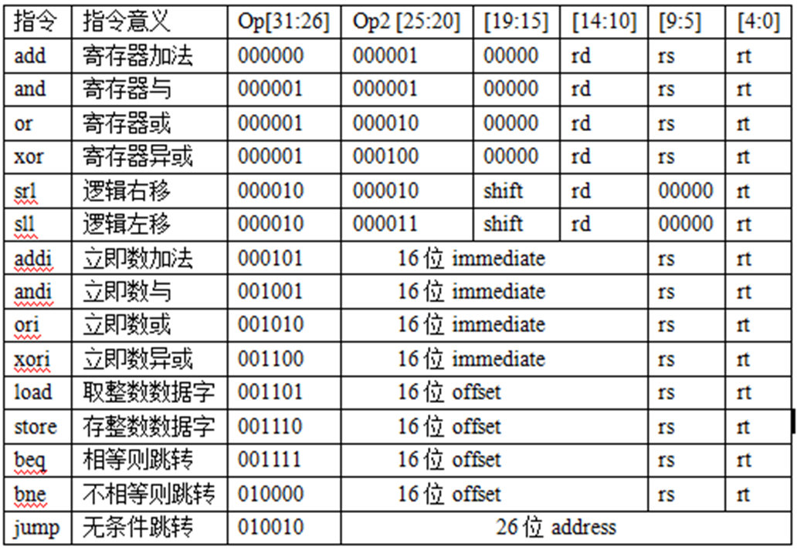

# 使用说明

把asm2bin.cpp，insts.txt，output.txt放在一个目录下（用相对路径写的文件读写），把指令序列中每条指令按照下面的格式放在insts.txt中，执行，直接复制output.txt的内容到ISE中就可以了

## 支持的指令集

## 输入格式

1. 寄存器用"rx"表示，x为一个10进制数
2. 立即数(shift, imm, offset, label, target)用"0x%x", "%x"为这个立即数的16进制表示

